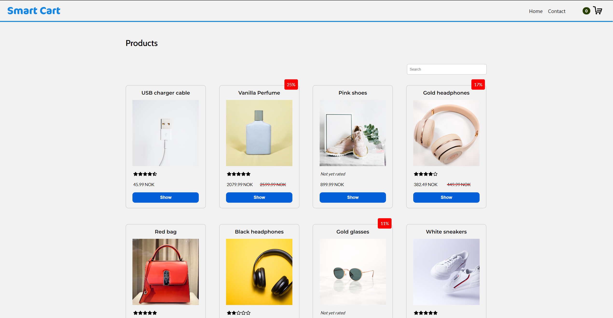

# Smart Cart

This is a website developed as part of a school project at Noroff - School of technology and digital media. This is a website concept for letting users add items to a cart.

## Description

- The aim for this website is to let the user buy products by having a dynamic shopping cart.
- Users can add and remove products to and from the shopping cart.
- The demographic this website is targeting are people who wants to buy miscellaneous products.

## Built With

- React
- Styled-components
- Zustand
- Yup
- API provided by the school

## Getting Started

### Installing

Make sure to have Node.js installed.

To install dependencies:

<pre>
npm i
</pre>

### Running

To run development server:

<pre>
npm run start
</pre>

## Website Link

https://cart-smartcart.netlify.app/

## Contact

https://www.linkedin.com/in/stian-dille-kornbakk-335b5a159/
